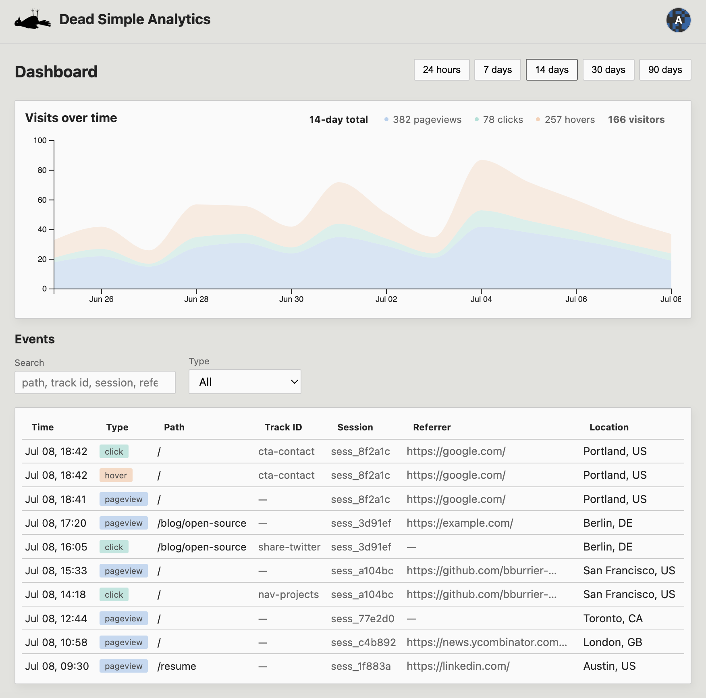

# Dead Simple Analytics
[](https://github.com/bburrier-ai/dead-simple-analytics/actions/workflows/ci.yml)
[](https://github.com/bburrier-ai/dead-simple-analytics/actions/workflows/ci.yml)

Self-hosted analytics for simple interaction tracking - pageviews, clicks, and hovers.



## Local

```bash
cp .env.example .env && make up
```

http://localhost:8082/login

## Deploy

1. Stand up a server (Ubuntu VPS)
2. Point DNS at the server, SSH in, clone this repo and run:

```bash
make install DOMAIN=analytics.example.com
```

## Track

1. Log in → **Sites** → add your site (name + allowed domains)
2. Copy the snippet from the table - it includes your `site_key` (e.g. `sk_…`)

```html
<script defer src="https://analytics.example.com/dsa.js" data-site="sk_…"></script>
```
